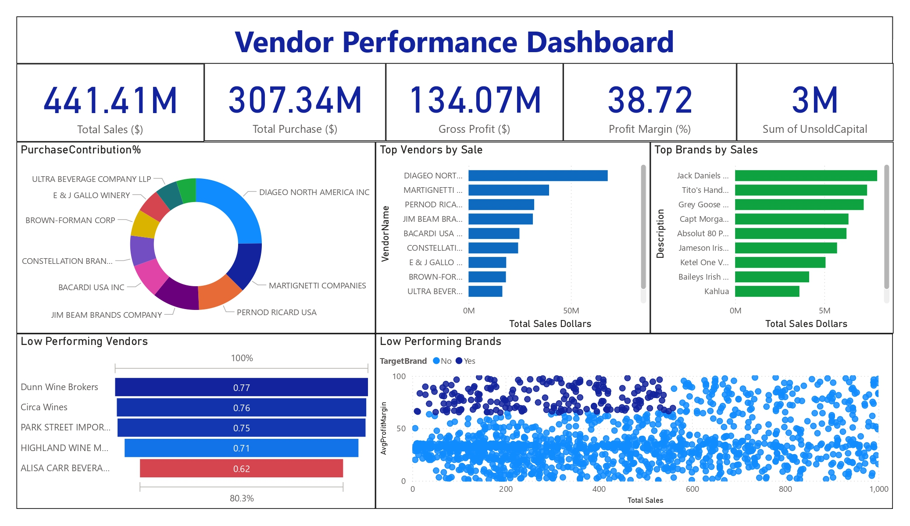

# Vendor Performance Analysis – Retail Inventory & Sales

A full-stack data analytics project using **SQLite**, **Python**, **Pandas**, **Seaborn/Matplotlib**, and **SQL** to create and analyze a comprehensive vendor sales summary table for retail procurement optimization.

---

## Objective

Merge and analyze data from multiple vendor-related tables to evaluate performance, profitability, stock turnover, and inventory risks—providing strategic insights for purchasing and inventory decisions.

---

## Visualizations

Insert your visual outputs here (e.g. dashboards, histograms, scatterplots):

- ETL and summary table structure image:
- Histogram or boxplots of distributions:
- Pareto chart of vendor contribution & donut chart:
- Scatterplot and top brand/vendor bar charts:

---

## Tools & Technologies

- **SQLite** – Local database to store raw tables (`purchases`, `purchase_prices`, `vendor_invoice`, `sales`) and the merged `vendor_sales_summary`.
- **Python & Pandas** – SQL querying, data cleaning, computing summary metrics.
- **SQL (CTEs)** – Efficient aggregation and join logic to build the summary table.
- **Seaborn & Matplotlib** – Visual eda, distributions, correlation heatmaps, scatter/donut/bar charts.
- **SciPy** – Hypothesis testing and confidence interval calculations.

---

## Workflow Overview

### 1. Database Inspection & Initial Queries
- Connected to `inventory.db` and listed available tables.
- Previewed record counts and sample data for each table.

### 2. Merge & Summarize
- Joined `purchases`, `purchase_prices`, `sales`, and `vendor_invoice` using SQL CTEs.
- Built the `vendor_sales_summary` table, capturing:
  - Purchase data: quantity, dollars
  - Freight costs
  - Sales data: total quantity, revenue, excise tax
  - Pricing: purchase vs. actual
- Stored summary in SQLite for simplified downstream access.

### 3. Data Cleaning & Feature Engineering
- Converted volume to numeric, filled missing values, trimmed whitespace.
- Created key performance columns:
  - GrossProfit = SalesDollars − PurchaseDollars
  - ProfitMargin (%) = GrossProfit / SalesDollars
  - StockTurnover = SalesQuantity / PurchaseQuantity
  - SalesToPurchaseRatio = SalesDollars / PurchaseDollars

### 4. Exploratory Data Analysis (EDA)
- Generated summary statistics and distribution plots (histograms & boxplots) for numerical features.
- Identified outliers, negative values, and inventory stock issues.
- Created correlation heatmap to understand relationships among features.

### 5. Business Insights
- Filtered to positive-profit, positive-sales entries for clarity.
- Identified brands needing promotional or pricing adjustments: those with high margin but low sales revenue.
- Visualized top vendors and brands by sales dollars and plotted vendor purchase contributions via Pareto and donut charts.
- Explored bulk-purchase behavior: analyzed average unit price across order size segments (small/medium/large).

### 6. Statistical Testing
- Computed 95% confidence intervals for profit margins of top vs. low-performing vendors.
- Conducted two-sample t‑test to evaluate whether differences in profit margins were statistically significant.

### 7. Exporting Final Results
- Saved cleaned summary data as CSV: `vendor_sales_summary.csv`.
- Ingested final DataFrame back into the `vendor_sales_summary` table in SQLite.

### 8. Created a Dashboard in PowerBI

---

## Key Insights & Metrics

- Negative gross profits and margins reveal unprofitable vendor-brand combinations.
- Highly efficient inventory turnover for some products contrasted with slow-moving stock.
- Identified specific brands with low sales but high margins—candidates for promotion.
- Pareto analysis: top vendors contribute a considerable share of purchase dollars.
- Clear evidence that larger order sizes yield lower unit costs.

---

## 🧾 License

This project is released under the **MIT License**. See [LICENSE](LICENSE) for details.
